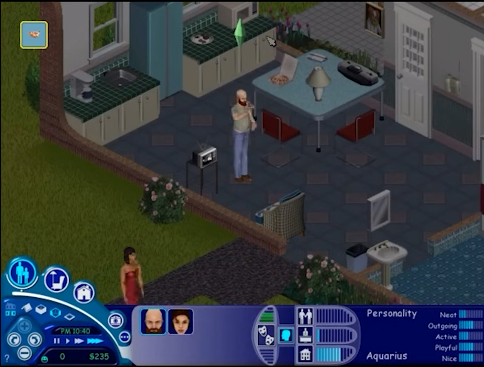
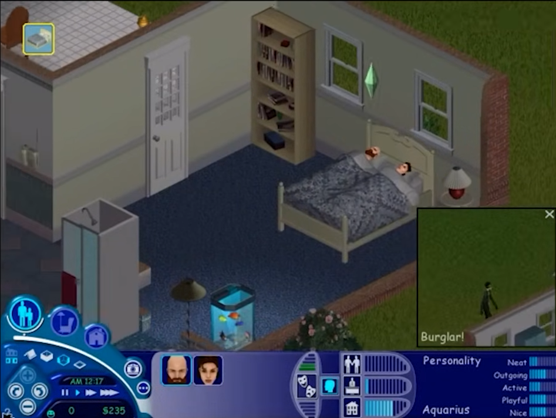
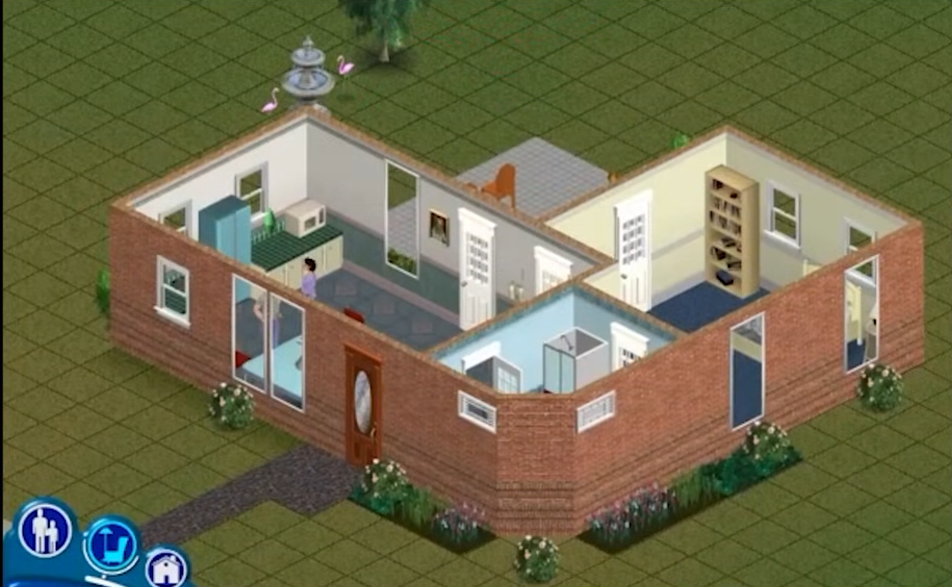

# Especificação da Implementação

> [!CAUTION]
> - Você <ins>**não pode utilizar ferramentas de IA para escrever esta
>   especificação**</ins>

> [!WARNING]
> - Após a entrega da primeira versão completa, esta especificação não
>   poderá ser alterada. A implementação final deverá corresponder ao que
>   estiver descrito neste arquivo.

## Integrantes da dupla

- **Aluno 1 - Nome**: <mark>`Karina Ribeiro Martins`</mark>
- **Aluno 1 - Cartão UFRGS**: <mark>`00590451`</mark>

- **Aluno 2 - Nome**: <mark>`Antônio Augusto Specht`</mark>
- **Aluno 2 - Cartão UFRGS**: <mark>`00595092`</mark>

## Detalhes do que será implementado

- **Título do trabalho**: <mark>`The Simsmulator`</mark>
- **Parágrafo curto descrevendo o que será implementado**: <mark>`Implementação do jogo The Sims 1. A ideia é fazer que o personagem tenha ações como comer, dormir, ir ao banheiro, entre outras acções. O ambiente onde irá se passar o jogo será na casa do personagem.`</mark>

## Especificação visual

### Vídeo - Link

> [!IMPORTANT]
> - Coloque aqui um link para um vídeo que mostre a aplicação gráfica
>   de referência que você vai implementar. **Sua implementação deverá
>   ser o mais parecido possível com o que é mostrado no vídeo (mais
>   detalhes abaixo).**
> - **Você não pode escolher como referência: (1) algum trabalho realizado
>   por outros alunos desta disciplina, em semestres anteriores. (2) Minecraft.**
> - Por exemplo, você pode colocar um vídeo de um jogo que você gosta,
>   e seu trabalho final será uma re-implementação do jogo.
> - O vídeo pode ser um link para YouTube, Google Drive, ou arquivo mp4 dentro
>   do próprio repositório. Mas, garanta que qualquer um tenha
>   permissão de acesso ao vídeo através deste link.

<mark>`https://youtu.be/RdVis25dXJk?si=rwEi_7I2MQ10F2OU`</mark>

### Vídeo - Timestamp

> [!IMPORTANT]
> - Coloque aqui um **intervalo de ~30 segundos** do vídeo acima, que
>   será a base de comparação para avaliar se o seu trabalho final
>   conseguiu ou não reproduzir a referência.

- **Timestamp inicial**: <mark>`20:22`</mark>
- **Timestamp final**: <mark>`20:40`</mark>

### Imagens

> [!IMPORTANT]
> - Coloque aqui **três imagens** capturadas do vídeo acima, que você
>   irá usar como ilustração para as explicações que vêm abaixo.
> - As imagens devem estar armazenadas neste repositório, no diretório
>   `images/spec/`, com os nomes `image1`, `image2` e `image3`.
> - Cada imagem deve usar o formato `.jpg` ou `.png`. Ajuste a extensão
>   nos vínculos abaixo para que corresponda ao arquivo armazenado.
> - Escolha imagens que correspondam a momentos do intervalo indicado
>   acima ou que sejam relevantes para a comparação com a implementação.

#### Imagem 1

- **Descrição**: <mark>`Personagem comendo pizza`</mark>

#### Imagem 2

- **Descrição**: <mark>`Personagens dormindo em uma cama`</mark>

#### Imagem 3

- **Descrição**: <mark>`Visão de cima da casa do personagem`</mark>

## Especificação textual

Para cada um dos requisitos abaixo (detalhados no [Enunciado do Trabalho final - Moodle](https://moodle.ufrgs.br/mod/assign/view.php?id=6302370)), escreva um parágrafo **curto** explicando como este requisito será atendido, apontando itens específicos do vídeo/imagens que você incluiu acima que atendem estes requisitos.

### Malhas poligonais complexas
<mark>`Tera modelos geométricos de móveis na casa onde será representado por malhas poligonais, assim como a intereção deles entre si. Ex: Ter uma mesa no chão e em cima dela ter um vaso de planta, copo, entre outros.`</mark>

### Transformações geométricas controladas pelo usuário
<mark>`A ideia é que tenhamos ma funcionalidade que podemos adicionar moveis na casa, seria um modo decoração.`</mark>

### Diferentes tipos de câmeras
<mark>`Teremos a câmera de visão livre e uma focal onde ao selecionar o persongem seguimos as acões que ele faz pela casa.`</mark>

### Instâncias de objetos
<mark>`Teremos mais de um móvel do mesmo tipo, que poderá ser rotacionado em diferentes posições`</mark>

### Testes de intersecção
<mark>`O personagem irá seguir seu caminho delimitado pela sua casa, ou seja, ele irá andar ou interagir só onde será possível`</mark>

### Modelos de Iluminação em todos os objetos
<mark>`Teremos a luz do dia onde vira da janela, por locais abertos, e a luz da lampada quando está a noite.`</mark>

### Mapeamento de texturas em todos os objetos
<mark>`<preencher>`</mark>

### Movimentação com curva Bézier cúbica
<mark>`<preencher>`</mark>

### Animações baseadas no tempo ($\Delta t$)
<mark>`<preencher>`</mark>

### Funcionalidade extra obrigatória

> [!IMPORTANT]
> - Descreva a funcionalidade extra relacionada à Computação Gráfica
>   que será implementada.
> - Esta funcionalidade também deverá ser documentada no arquivo
>   `README.md` da entrega final.

<mark>`<preencher>`</mark>

## Limitações esperadas

> [!IMPORTANT]
> - Coloque aqui uma lista de detalhes visuais ou de interação que
>   aparecem no vídeo e/ou imagens acima, mas que você **não pretende
>   implementar** ou que você **irá implementar parcialmente**.
> - Para cada item, **explique por que** não será implementado ou por
>   que será implementado parcialmente.

<mark>`<preencher>`</mark>
